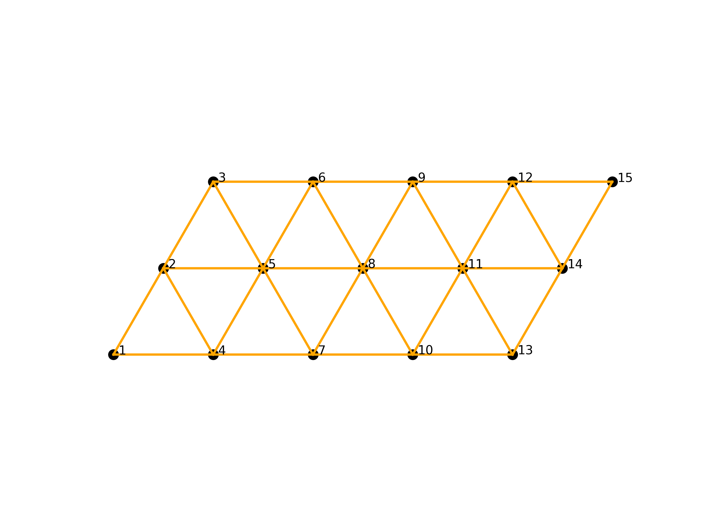

# Lattice_tool
Lattice tool for creating different geometry. This is useful for ITensor library as well as cylindrical boundary for 2D lattices are implimented using an argument called "yperiodic". 

Kagome:

<<<<<<< HEAD

=======

>>>>>>> 98b7a4ed1084c475bd1faf0c30b41cd0f7e98a23
