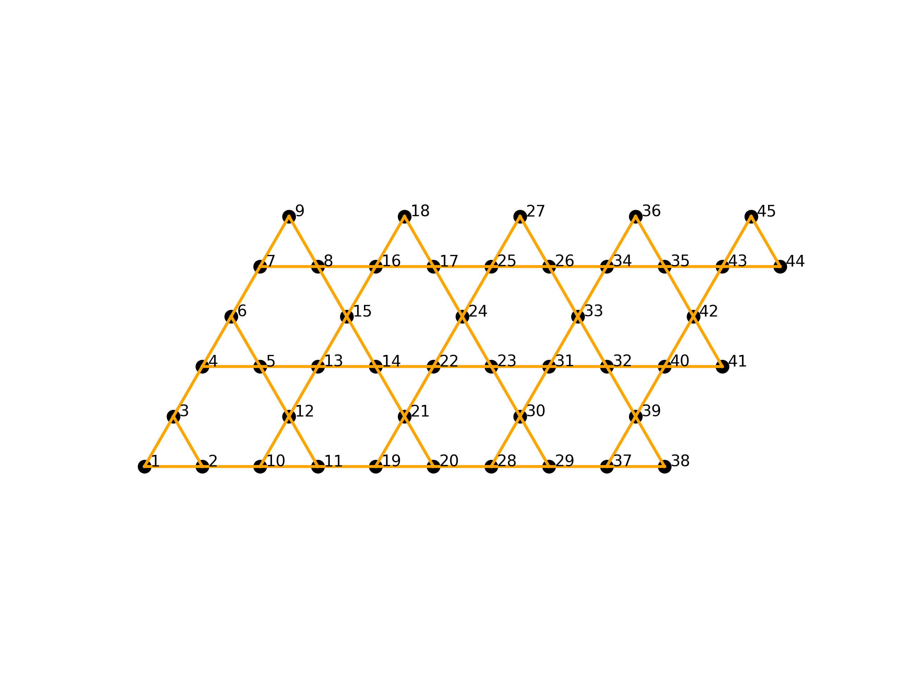

# Lattice_tool
Lattice tool for creating different geometry. 
This is useful for solving lattice Hamiltonian and can be implemented with ITensor library as cylindrical boundary for 2D lattices are implimented using an argument called "yperiodic".  

C++ version of lattice_tool for itensor C++ is included in the c++ folder.

# Inputs:

string type: lattice type (square, triangle, kagome, and honeycomb are implemented)

int $\text{Lx}$: number of unit cells along $\text(a1)$ direction

int $\text{Ly}$: number of unit cells along $\text(a2)$ direction

string boundary_condn: boundary condition (either "open" or "yperiodic")

# Kagome Lattice:

